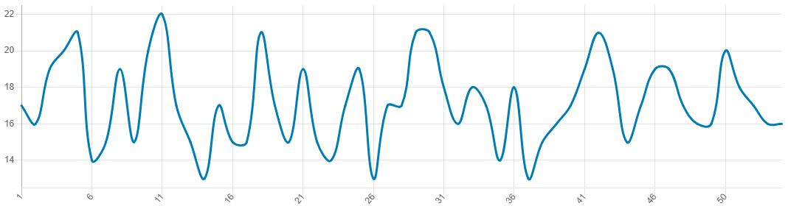

# Repeater

A lightweight cross-platform input repeater with a trigger-based activation.

## Usage

Download the latest release from the [Releases page](https://github.com/david-soliar/Repeater/releases/latest), extract it, and run the executable.

Follow the console prompts to configure:
- minimum / maximum repeats
- idle check interval
- action (what gets repeated)
- trigger

## Platform Support

Works on Windows (x64), ~~Linux (x64), and macOS (x64 & arm64)~~ .

## Exit

Press `Ctrl + C` to exit, or simply close the terminal to stop the program.

## Behavior

The repeat rate dynamically fluctuates between the configured minimum and maximum values.
It may occasionally dip slightly below the minimum due to CPU scheduling and system load variations.

Example run used to generate the graph below:

```console
Min repeats: 15
Max repeats: 25
Idle check (in milliseconds, 10-500): 20
Press key to repeat...
Using key: 0x01 (Mouse)
Proceed? (y/n): y
Press trigger key...
Using key: 0x06 (Mouse)
Proceed? (y/n): y
Running...
```



*Typical resource usage during operation: ~10 MB RAM and <1% CPU.*

---
### Use responsibly.
